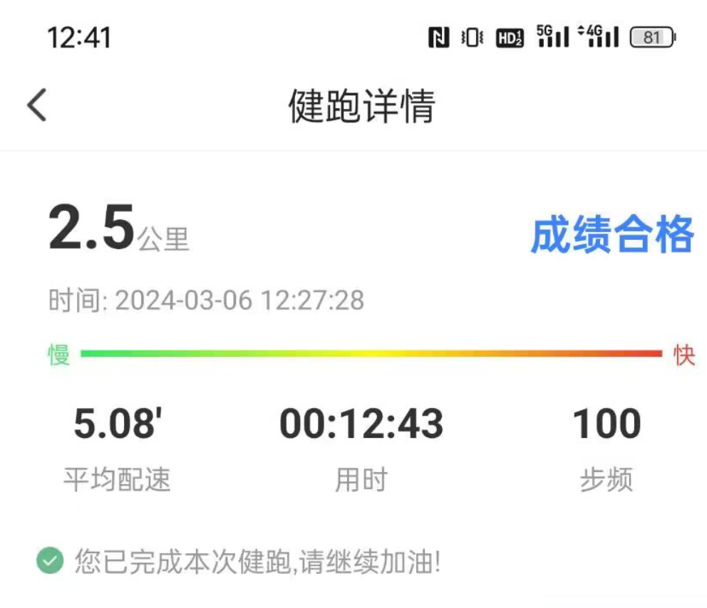

### 摘要：

这是新版本(3.0.0)云运动代跑脚本，可以进行云运动全自动代跑。接口是合肥工业大学特化(可能)的版本，细节会在后面说明。

**提前说明：本项目是针对合工大翡翠湖校区的，用的是新版本的接口，其他学校接口一样或者其他校区也可以用，只不过要配置，下面会有详细的教程。这个仓库比较适合有基础的同学。**

### 相关工作：

之前的工作：感谢yun大佬的初代脚本[kontori/yun: 云运动一键跑步脚本，理论上适用于一切使用云运动的学校的健跑任务，包括但不限于合肥工业大学 (github.com)](https://github.com/kontori/yun)，为整个脚本提供逻辑框架，可惜作者停更了。

最新消息：仓库公开前已经有人完成了相关工作，[StarYuhen/Yun: 云运动，协议一键刷路程脚本 (github.com)](https://github.com/StarYuhen/Yun)，不过用的接口和合工大的不同，已经测试了合工大用的是`/splitPointCheating`接口，`headers`也大改加了检测，所以合工大学生不能直接使用那个版本。那个项目issue里面提到的更新版本也是这个原因。(随口一提：其实我猜项目作者学校使用的才是老接口，合工大其实是新接口，那位打的其实是简单局，虽然难度也没差多少就是了)（错了当我没说...）

### 更新记录：

1. 2024/3/14：添加打表模式，修复路径问题。(可惜finish返回500的问题还是没解决，不过不影响用，就是看着难受)

   

### 使用方法：

**概览：**

1. `pip install -r requirements.txt`
2. 配置`config.ini`文件
3. `map.json`选点
4. 配置`tasklist.json`伪造痕迹(可选)
5. `pyhton main.py`
6. 按照提示操作即可

**细节：**

1. `config.ini`大多数参数填写参照yun项目即可。
2. 补充几点：
   - headers: 合工大的新版本补充了utc，uuid，sign等参数，同token和deviceId一样需要获取，建议抓包获取，登录接口因为跳转门户，已经失效，本脚本只支持抓包方法。
   - Cheating: 新版本点的提交改了接口，返回的也不一样，不能直接使用老方法。
   - map: 合工大的地图就一个操场，原版本的找点方法不建议使用，我手动挑选了几个点，现在已经改成了新方法。
   - 这个脚本提供了快速模式，无需等待直接通过，不过没有轨迹，但是程序算你过(不是实在没时间别用，被人工干了别找我.jpg)
   - 脚本里面还有一个**起始点**，很多人忘记改这个了，导致路线是合工大翡翠湖飞到他的学校，所以无线重试规划路线，别忘记改了。
   - 据测试，合工大服务器发送结束信号有时候返回是`服务异常稍后再试`，但是事实上是算达标的，目前还没摸清楚规律（不过能用了你还管什么.jpg）只有明确说你不合格，还让你加油，那个才是寄了。
   **看似寄了：**
   
   **实际上活着：**
   
   **我目前就只有一个人的finish信息，还是没跑通过的，所以没法确定这个返回异常的问题在哪，如果有post /run/finish的包可以和我分享一下。(找一个人跑步开抓包怎么这么难)**
   *(解决不了这个不影响使用，懒改了，让我跑步打死不去)*
3. 配置config的具体事项*(本校区所有功能改config.ini就行了，下面复杂的你可以不看，不过最好看一下，对自己的跑步路线负责一点)*：
   - 填写token,device_name和device_id，抓包获得，不建议更改。
   - 填写map_key，按照最初作者的做法进行即可，如果没有可以打表，我后续会给一张`tasklist.json`的表用于load。(翡翠湖校区only)
   - 填写utc，uuid，sign，事实上uuid是固定的，utc是时间生成的随机数，sign是这2者的md5值，服务器只会验证sign是不是前二者的md5，所以可以一套用到死。(这个是新的接口)
   - 只需要填写user部分就行，其他地方我已经设置默认值，是调试后比较好的，如果你不知道那是什么，请不要更改。
   - **太长不看版本：抓包把config里面缺的都填上去就完事了，高德的key自己申请一个，可以不申请，具体看后面。**

**更新--打表模式：**

- **简介：**群里有人说老师已经知道有脚本这回事了，不过检测方式大概率是人肉识别。好不容易周四下午就一节课，配合逃一个晚自习来搓脚本。这次来更新一个打表模式。

- **实现：**

  合工大翡翠湖校区同学无需配置tasklist.json，点开脚本选择打表模式就行，我默认提供一套路线方案。(当然最好还是换一下，都一样不太好，以后再更新加偏移)

  **其他校区或者学校要额外配置：**

  1. 抓历史跑步记录包，云运动点开任意一次的跑步记录(可以是上学期的)，抓取返回的response body。
  2. 解密密钥，解密返回CipherKey(sm2)，因为gmssl和Java验签的问题，这个解密不能用提供的decode_sm2函数，要用Java的`cn.hutool`包(云运动用的加密库就是这个)，不会Java也没关系，[SM2 - 在线工具 (toolhelper.cn)](https://www.toolhelper.cn/AsymmetricEncryption/SM2)给你找了一个网站可以解密成功(这种工具网站都是前端计算，不用担心数据泄露，况且这是云运动的密钥泄露不关我事【逃)，公钥和私钥在config.ini里面，模式选c1c3c2。
  3. 解密数据，用解密的密钥作为key，用我脚本里面的decode_sm4解密或者你也用工具网站解密都行，解密的内容就是历史跑步记录的信息了(一整个大的json体，特别长，100+kb)，包括路径点。
  4. 拷贝到tasklist.json，把解密的整个json拷贝过来就行，不用你提取data部分，返回值200等信息我知道没用，但给大家方便点，直接解密的json整个拷贝过来到tasklist.json就行了。这其中大多数信息是用不上的，是跑步者的个人信息，不过你不删也无所谓。(我提供的当然删个人信息了，别想害我【其实是损友的)
  5. 跑代码，我自己跑的是没问题的，如果跑不起来多检查一下，这教程也不是写给纯小白看的，各位看懂报错信息Debug一下应该不是难事。

- **效果展示: **

  - 肉眼无法分辨真假的轨迹：

    

  - 进度条显示(只支持打表模式)

    

- **更多细节：**

  1. 踩点用的**还是map.json的点**，**不是那次跑步路线的关键点！**，别问为什么，问就是我自己的那一次打表数据踩的点和新版本对不上不能直接用，就偷懒了。对于新版本的跑步记录，或者外校的，推荐修改一下。本校区是无脑用的。(如果要改成那一次跑步的踩点信息，把finish_by_points_map函数里面`'manageList': self.manageList,`改成`'manageList': self.task_map['data']['manageList'],`就行了)
  2. 配速、里程等信息不受config.ini控制了，看的是tasklist.json，如果要用原来的，代码里面把调用的`finish_by_points_map()`改成`finish()`就行，不过路线和里程速度对不上。(无路线都给过，你怕什么)
  3. 进度条显示用了tqdm库，我安装的库太多了，已经不知道这是不是自带的库了，所以也写到了requirements.txt里面，如果出现什么错误，删了就行。
  4. 理论上是可以不用**高德地图的api**的，不会申请的小伙伴有福音了，不过，我代码写太乱就匆匆打包了，这个读取路线还是放在了构造函数里面，删了会报错。所以你要自己把构造函数里面的generate_task函数调用注释掉，或者把整个改到其他方法里面调用。
  5. 附：我这个脚本主要是给各位提供一个代跑方案，给出新版本密钥，main.py是一个我的实现，封装没怎么做，但细节解释的很详细，你完全可以照着自定义成你的脚本，实现你自己想要的功能(比如issue里面的场馆预定，抓包找规律就行了，其实是搬砖活【滑稽)

**补充抓包教学：**

发现很多老哥卡在抓包上了，其实这个云运动是学校架设服务端，还用的http，所以基本上随便抓包，不用什么群里说的fiddler远程、CA证书、ss代理等，甚至还有群友kali都整上了...

其实没这么复杂，我这里介绍一个最简单的方法，**不用root，有一部手机就可以**：

1. Google Play上随便搜一个抓包软件(搞不定Google？你都能上github还搞不定Google？【笑)

   

2. 安装它，配置VPN给它过(演示用的群友给的`PCAPdroid`，你用哪个都差不多)

   

3. 进云运动，随便翻一翻

4. 如果是对于合工大的，找到`ip`是`210.xxx.xxx.xxx:8080`的包就行

   

5. copy里面headers的一切，照着填上去就行了

   

6. 还有老哥问sys_edit这个参数，这个是安卓大版本，随便填一个就行，我一般填12，当然我手机是安卓13，服务器不会检查这个

**其他校区要改的(其他学校也差不多)：**

1. `map.json`的点，你自己post一下getHomeInfo那个，对着地图选几个好看的点填上去就行。我把原作者的随机选点方法弃用改成了手动选点的方法，因为学校很贴心的把位置限定在了一个操场，选的点太乱会导致轨迹魔怔(虽然现在轨迹也很魔怔，不过起码不会抽搐了)

   **补充：**issue里面有老哥提到了轨迹问题，我详细介绍一下`map.json`的作用：

    	1. 这个`map.json`记录的是跑步的控制点，控制着给高德导航目的地的顺序，导航会从里面的上一个点走向下一个点。
    	2. config.ini里面有一个参数是初始点，这是导航最开始的点，别只改map忘记改这个了。
    	3. getHomeInfo的点是关键点，就是你跑步要踩点的几个点。
    	4. 把getHomeInfo的点copy过来相当于作者原本的导航直冲关键点方法，好处是方便，缺点是可能路径直来直去会魔怔。
    	5. 你可以自己对着地图选优质的点，按顺序填入，从而准确的控制脚本走的路径。
    	6. 当点距离足够近的时候还是推荐用导航，因为导航会返回距离，当然如果你有用经纬度精确计算里程的把握，你可以设计算法手动跑，这样就不需要高德的map_key了。
    	7. 经过测试，服务器的关键点也是以你给的点为准，你说什么点是关键点，有没有踩点，服务器就信什么。

   **代码实现细节(偷懒)：**

   脚本默认会把`map.json`里面的点当成控制点上传给服务器(回跑的时候不会重复上传关键点)。这是一个偷懒的方式，如果你直接用getHomeInfo的点就不会有问题，当然如果你微操每一个点，打上100个，可能出现一次跑步100个关键点的逆天情况，这时候你可以改代码，比如每20个点add_task后才给manageList.append()一次关键点。*(别问我为什么不去实现一个选项，有些时候，自己改2行代码就可以实现的东西，真的懒去实现选项 ^_^ )*

2. tasklist.json文件的配置，伪造肉眼难以分辨的轨迹，详情见上面更新部分。

3. 如果是其他学校要改主机，这个很简单，替换一下就行，当然接口如果用的不一样你直接访问上面另一个人的实现就好，那个老哥github答疑很勤快，靠得住。

### 更多技术细节：

#### 云运动新版本的加密模式：

1. 随机生成sm4密钥，通过sm2加密sm4密钥。对应"cipherKey"参数
2. 用sm4密钥加密数据，对应"content"参数

#### 云运动防止修改的小细节：

1. sm2密钥存放于`crs-sdk.so`中，包括公钥和私钥。
2. 这个c++ 库会检查dex文件，如果文件被篡改，会返回错误的密钥(服务器可能因此判定软件作弊)。
3. apk安装包文件被360壳保护，需要脱壳才能反编译。
4. 服务器使用`/run/splitPointsCheating`域名，加入了检测，路径不能再魔幻了。

#### 本次实现的细节(偷懒部分)：

1. utc是随时间自动改变的，但服务器不会验证，所以可以不管，保证一套sign和utc、uuid对应上就行，具体表现是一次抓包获取一切。
2. cipherKey你给服务器什么服务器就用什么，所以我是直接默认给了一个cipherKey，用到死(偷懒，逃)，当然如果你愿意随机密钥，我提供了sm2加密解密函数和公钥私钥，你可以自己改代码实现。(其实原本不打算偷懒的，但java实现用的hutool和python的gmssl验签过不了，不知道什么原因，看上面那个实现也是一套cipherKey用到死，就不管了，逃~)
3. finish你说什么服务器信什么，你就是刚刚start原地没动下一秒finish说跑了2公里，服务器都信。路径点都不用上传的，我已经用这个方法干好几天了，系统算的是通过，所以就做了一个快速模式，还是不要用为好。

#### 加密破解方法(面向开发者)：

0. 这个加密的破解搞的头大，大一下课排满了，晚自习搞破解，要不然上周末应该就出来了(周六工程课进厂打工一天我"爱你"合工大)。
1. 反编译是通过Frida把真正的dex文件hook出来的，使用安卓虚拟机+adb。
2. 使用dex2jar项目把dump出来的dex文件变成jar文件，然后使用jd-gui反编译找的加密代码。
3. so库使用IDA分析的，IDA不是Pro居然还不给我分析ARM文件，逆天。
4. 全套反编译出来的文件和测试的代码可以找我要，不过我一般没事不看github。

### 最后：

欢迎新人加入23届CTF比赛群。(虽然我是计科的，而且不一定打CTF，更多时间在跑AI (CV) ....)
有问题进群私聊~

**有人私聊项目维护的问题，我解答一下：只要23届还要跑步，这个项目就不会停更，可能实现方法会很挫，但一定可以跑起来(跑不起来就是我菜)**

*免责声明：一切内容只能用于交流学习，24h内自觉卸载，否则后果自负。*
